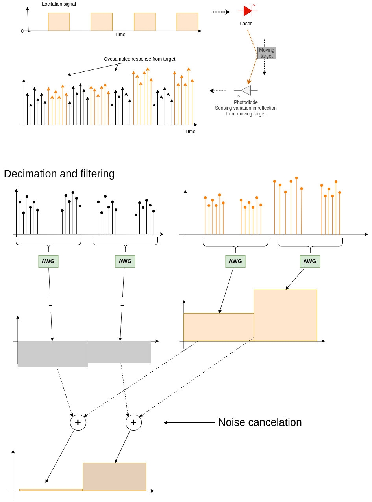

# Arduino Synchronous Detector

This code demostrates a low frequency lockin amplifier or synchronous ligth detector inplementation using only a Arduino board and 2 additional modules: 
  1. The OPT101 amplified vissible light photodiode 
  2. A laser pointer 
  
The syncronous detector components ar all realised in software 
using the Atmega328p builtin ADC as frontend.

## Basic principle

## Analog implementation

## Full microcontroller inplementation with Atmega328p

##  Basic specs (work in progress)
ADC raw samplerate is 78.6kHz with estimated > 8 bit resoluition. 
(LSB is a bit unstable becuse of the high samplerate)
ADC resolution is >14 bit after oversampoling and decimation
Laser modulation or exitation frequency 12.8kHz, and so also the LO frequency of the sychronous detector.
After decimation the output samplerate from the detector is 12.8 / 4^6 = 3.125 kS/s
Ewerything is divided down and synchronous to the ADC raw samplerate clock.
  
  
