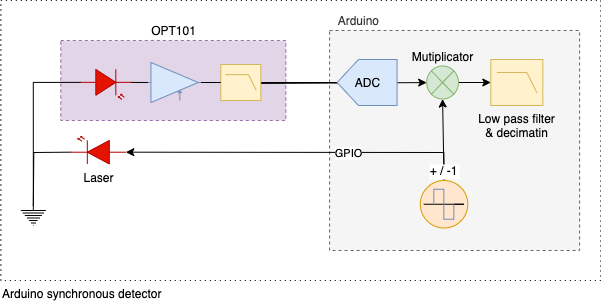

# Arduino Synchronous Detector

This code demostrates a low frequency lockin amplifier or synchronous ligth detector inplementation using only a Arduino board and 2 additional modules: 
  1. The OPT101 amplified vissible light photodiode 
  2. A laser pointer 
  
The syncronous detector components are all realised in software 
using the Atmega328p builtin ADC as frontend and one GPIO for driving the laserdiode.

## Whys and hows
The idea behind a synchronous detector or lockin amplifier is best described trough an example. So lets asume we want to detect a moving target at some  distance. To be able to do this one could for example shine some ligth on the target and look for changes in the reflected light. If setting up this experiment with a light source and a photosensor we will soon discover that the reflected light variation we are trying to measure is not distingusable from variations in the ambient light level as shown in the top figure below. If we instead modulate our signal source with some frequency and lock our detector to the same frequency and phase we have what is called a synchronous detector. 

As shown below the synchronous demodulation process cancels out ambient noise and we are left with the signal of interest only.

Thie noise cancelation part is a bit hard to grasp in the frequncy domain, but if we instead consider that the modulated source is realy just swithing on an off the light source at a constant frequency, and thus on the receiver side the same bacground noise will be present in both halfperiodes of the signal, both when the ligth source is on and when it is off. The demodulator is just a multiplicator that multiplies the signal with a square waveform with amplitude +1 to -1. at the same frequencuy and phase as the source modulation. The +- multiplication basicaly flips the sign on the noise in each halfperiode so the noise average over time from the demodulator is close to zero. This process is shown in the following figure.

### Basic principle

### Analog implementation
The analog implenetation of a locking amplifier is shown below. These devices are built up around a oscilator and a RF mixer where the oscilator is source for both the exitation and the demodulator, this way it is always in phase lock.

### Full microcontroller inplementation with Atmega328p
Understanding that a RF mixer is realy just a multiplicator we see that we can easily implement this whole circut in a microcontroller as shown below. 

### Expanded view of actual implementation
By filtering the reflected signal while under exitation and the reflected signal when exitation is off in two separate arrays we are able to also measure and log the backround ligth level.

###  Sampling and signal bandwith (work in progress)
ADC raw samplerate with prescaler set to 16 in free running mode is 16 MHz/(16*13) ≈ 77kHz. estimated > 8 bit resoluition. 
(LSB is a bit unstable because of the high samplerate).
The resulution is then increased by 6 bit trough downsampling by 4^6 = 4096 giving us a downsampled samplerate of 77k / 4096 = 18.79Hz
The exitation pulse length is set to 16 samples and 50% dudty cycle so the Exitation pulse rate is 77kHz/(2*16) = ~2404Hz.
The bandwith of the opt101 sensor is 14KHz so 2.4kHz exitation frequency is wel within this band.

Ewerything is divided down from and synchronous to the ADC raw samplerate.
